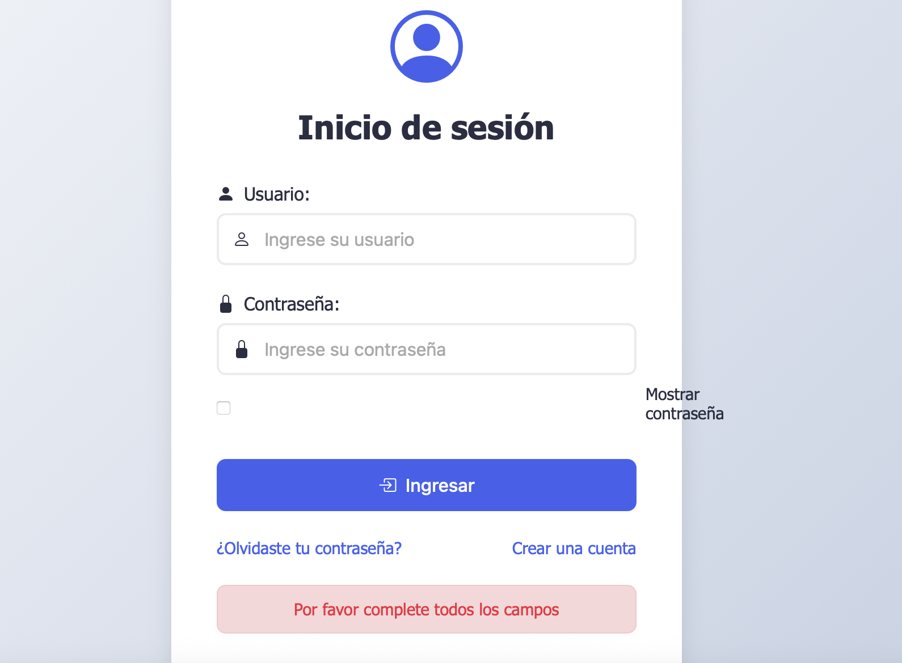
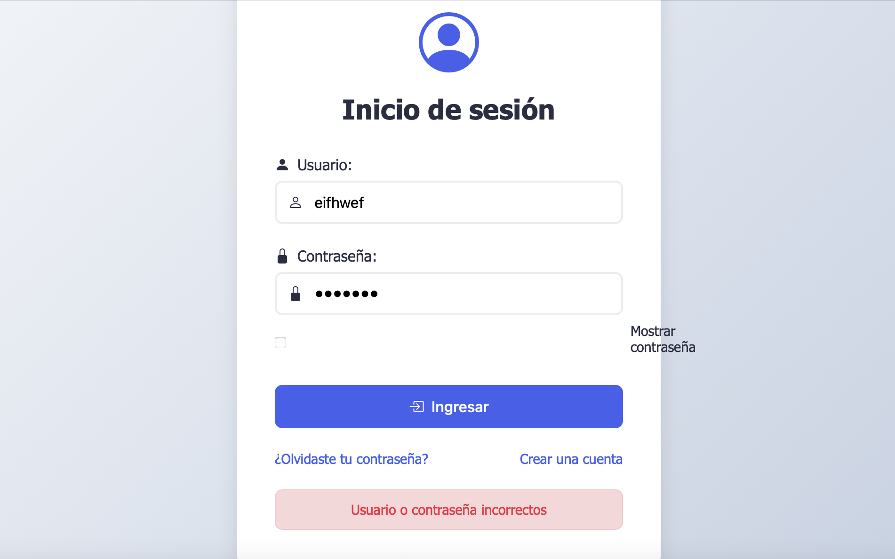
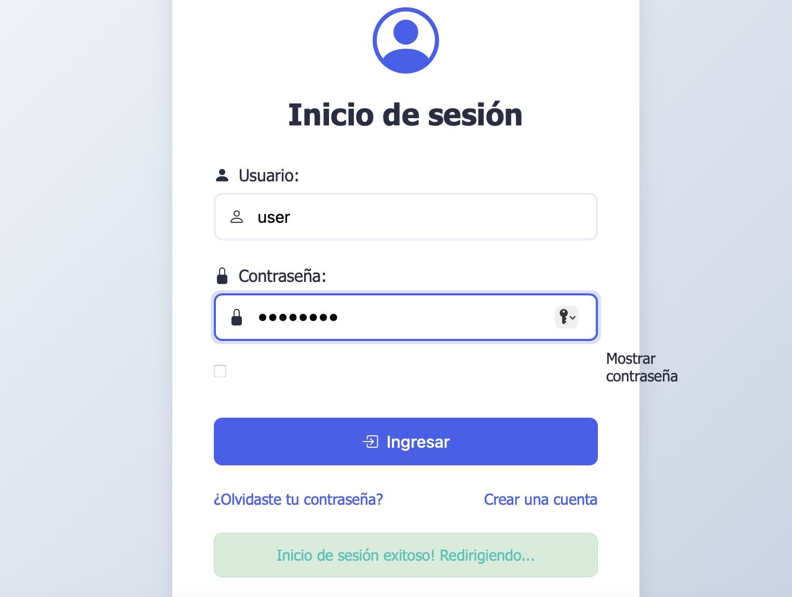
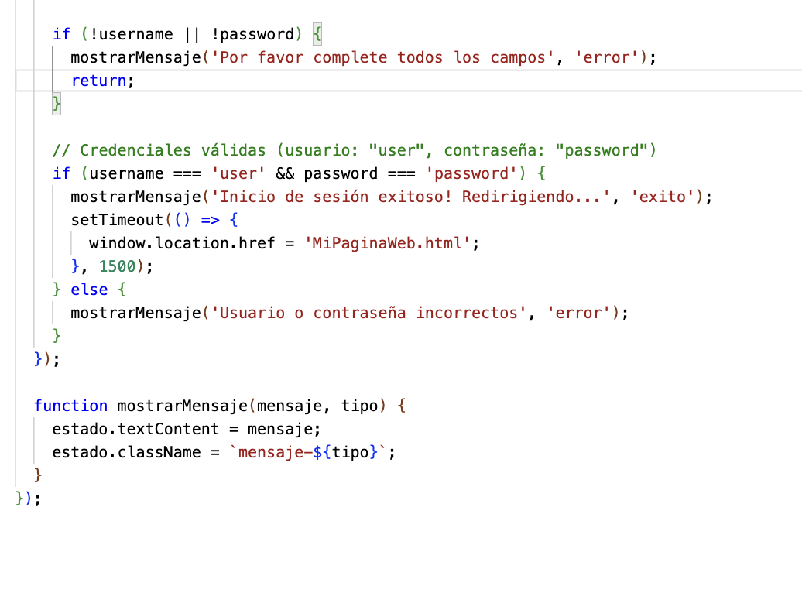

#  Login - Página de inicio de sesión

Proyecto de página de inicio de sesión centrado y responsive, con validación simple en JavaScript y estilo moderno usando CSS y Bootstrap Icons.

## Proyecto de Login  

## Ver Online
Puedes probar la demo aquí:  
<a href="https://romanreynaldo.github.io/Login/" target="_blank">Ver Demo Online</a>

##  Características

-  Formulario de inicio de sesión simple y funcional.
-  Opción para mostrar/ocultar la contraseña.
-  Validación de campos vacíos y credenciales de prueba.
-  Interfaz limpia, moderna y responsive.

---

##  Cómo usar
Descarga el archiuvo desde menu de descargar de GitHub

## Captura de pantalla
### 🔒 Login vacío

### ❌ Intento de login incorrecto

### ✅ Login exitoso

###  Html 

###  JavaScript 

## Prueba con credenciales válidas
Usuario: **user**

Contraseña: **password**

*Si los datos son correctos, se mostrará un mensaje de éxito y se redirigirá a MiPaginaWeb.html.*

## Licencia
Bajo licencia libre y para usos académicos

## Contacto
Reynaldo Roman
reynaldoroman@gmail.com

